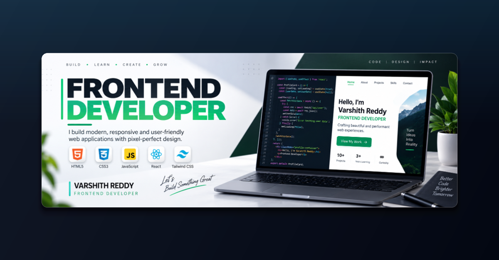

# Varshith Reddy — Frontend Developer

Crafting modern, responsive, and user-friendly web applications with pixel-perfect design.

---

## Tech Stack

- **Frontend:** HTML5, CSS3, JavaScript (ES6+), React, Tailwind CSS
- **Design & UI:** Responsive Design, Fluid Typography, Pixel-Perfect Layouts
- **Hosting & Deployment:** Render

---

## Live Website

Check out the live interactive portfolio at:  
**[https://portfolio-gvc2.onrender.com/](https://portfolio-gvc2.onrender.com/)**

---

## Contact & Connect

- **LinkedIn:** [Varshith Reddy](https://www.linkedin.com/in/varshith-reddy-b2914b23a/)
- **GitHub:** [@Varshith989](https://github.com/Varshith989)
- **Email:** [reddyvarshith122@gmail.com](mailto:reddyvarshith122@gmail.com)